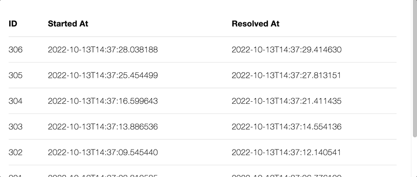

# BidirectionalScroll

A companion to the tutorial post [Efficient bidirectional infinite scroll in Phoenix LiveView](https://dev.to/christianalexander/efficient-bidirectional-infinite-scroll-in-phoenix-liveview-3epd).

To start your Phoenix server:

  * Install dependencies with `mix deps.get`
  * Create and migrate your database with `mix ecto.setup`
  * Start Phoenix endpoint with `mix phx.server` or inside IEx with `iex -S mix phx.server`

Now you can visit [`localhost:4000`](http://localhost:4000) from your browser.

